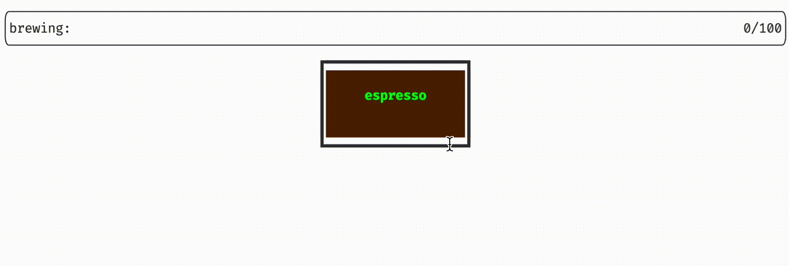

# Advanced Programming - HW5
<p  align="center"> <b>Homework 5 - Spring 2022 Semester <br> Deadline: Saturday Ordibehesht 31th - 11:59 pm</b> </p>

## Outline

In this homework, we are going to tackle inheritance and polymorphism in C++. We are going to make different kinds of espresso-based coffees using their ingredients. As you know all espresso-based coffees (like Cappuccino, Mocha, Latte, and ...) have espresso in their recipe and their difference happens in other ingredients like Milk, Milk Foam, Water, Chocolate, and ...

We will implement a base class called `Ingredients` and derive all our necessary ingredients from it.
We also implement another class called `EspressoBased` and derive our espresso-based coffees from it.

<br>
<p align="center">

</p>
<br>
In the above picture, you can see the recipe for the most famous espresso-based coffees. Take a little time and look at this picture, you will need to make a couple of these coffees in this homework.

</br>

# Ingredient Class
Define an **abstract** class named `Ingredient` and add the following functions to the class.

```cpp
class Ingredient
{
public:
    double get_price_unit();
    size_t get_units();
    std::string get_name();

    double price();
    

protected:
    Ingredient(double price_unit, size_t units);

    double price_unit;
    size_t units;
    std::string name;
};
```


The functions of this class are straight forward. As for the member variables: `price_unit` is an indication of what is the price of this ingredient per unit. `units` will show how many of this ingredient we will be needing. The `price()` function will calculate the final price of the ingredient. `name` is going to be the name of the ingredients, which can be Espresso, Milk, Chocolate, or ...

Since the name of the ingredient is not yet known, make `get_name()` a pure virtual function and so the class an abstract class.

***note.*** you don't need to define your functions in a .cpp file, do all the implementations in the `ingredient.h` file.

***Question.*** why do you think the the constructor and the variables are defined as `protected` and not `private`? answer the question in your report after you completed your code.

</br>

# Sub Ingredients
Now we are going to use the above class and implement the actual ingredients we will be using. in this homework we need 8 ingredients called:
- **Cinnamon** - *price per unit: 5*
- **Chocolate** - *price per unit: 5*
- **Sugar** - *price per unit: 1*
- **Cookie** - *price per unit: 10*
- **Espresso** - *price per unit: 15*
- **Milk** - *price per unit: 10*
- **MilkFoam** - *price per unit: 5*
- **Water** - *price per unit: 1*

Derive a class for each of these items from our base class (Ingredient class) and assign the necessary values so that the test cases would pass. like below.

```cpp
class Cinnamon
{
public:
    Cinnamon(size_t units) : Ingredient{5, units}
    {
        this->name = "Cinnamon";
    }

    virtual std::string get_name() {return this->name;}
};

```

***!!!!*** Do you feel doing the same thing 8 times for each ingredient is wrong and a waste of time? can't say you are wrong! see the Challenge section to stop repeating your code for each class.

***note.*** Do all your implementation of these classes in the `sub_ingredient.h` file. (no need to separate the classes into different files)

</br> 

# EspressoBased Class
Define an **abstract** class named `EspressoBased` using the code fraction below.

```cpp
class EspressoBased
{
public:
    virtual std::string get_name() = 0;
    virtual double price() = 0;

    void brew();
    std::vector<Ingredient*>& get_ingredients();

    ~EspressoBased();

protected:
    EspressoBased();
    EspressoBased(const EspressoBased& esp);
    void operator=(const EspressoBased& esp);

    std::vector<Ingredient*> ingredients;
    std::string name;

};
```
We will be using this abstract class as a base to create our coffees. As seen in the picture in the outline section, each espresso-based coffee is made by different ingredients. These ingredients are going to be stored in the `ingredients` variable.
`get_ingredients()` will return this variable. The `price()` function will calculate the final price of the coffee, and the `name` is the name of the coffee.

Implement both default and copy constructors for the class, and Since we have dynamic pointers, define the destructor so it will delete all the pointers in the `ingredients` vector. use the following code in order to do this:

```cpp
EspressoBased::~EspressoBased()
{
    for(const auto& i : ingredients)
        delete i;
    ingredients.clear();
}
```

**The Brew() function** this function must show the steps of making the coffee. the better you implement this function the better score you'll receive from this assignment. you can even use UI libraries to do so. you can see an example of a good output for this function in the following gif. (This output is implemented by a Terminal UI library)

<br>
<p align="center">

</p>
<br>

In this homework you are allowed to change `Dockerfile`, `CmakeLists.txt` or add new files if you want to use an external library for this section.


***note.*** Implement this class in `espresso_based.h/.cpp` files.

***Question.*** what happens if you define the destructor i.e. `~EspressoBased()` in the protected section? explain your answer in your report.
 

</br>


# Cappuccino Class
Derive the `Cappuccino` class from the above abstract class using the needed ingredients for a cappuccino. A cappuccino needs 2 units of espresso, 2 units of milk, and 1 unit of milk foam.

```cpp
class Cappuccino
{
public:
    Cappuccino();
    Cappuccino(const Cappuccino& cap);
	~Cappuccino();
    void operator=(const Cappuccino& cap);

    virtual std::string get_name();
    virtual double price();

    void add_side_item(Ingredient* side);
    std::vector<Ingredient*>& get_side_items();

private:
    std::vector<Ingredient*> side_items;

};
```
Other than the base ingredients needed to make a cappuccino the customer may ask for some side items (like sugar, extra milk, and ...). The `add_side_item()` is responsible to add these side items. (to calculate the final price of the coffee: consider the side items as well as base ingredients)

Implement the default, copy constructor, and operator= for this class. Since we have dynamic pointers you should also implement a destructor to delete them. use the following code in order to do this:

```cpp
Cappuccino::~Cappuccino()
{
    for(const auto& i : side_items)
        delete i;
    side_items.clear();
}
```

***note.*** Implement this class in `cappuccino.h/.cpp` files.


</br>

# Mocha Class
Derive the `Mocha` class from the `EspressoBased` abstract class exactly like cappuccino using the needed ingredients for a mocha. A mocha needs 2 units of espresso, 2 units of milk, and 1 unit of milk foam and 1 unit of chocolate.

</br>


# Challenge
- In the `Sub Ingredients` section of your homework, you probably noticed that you need to repeat almost the same code over and over again to implement the ingredient classes. Luckily for you, there is a way to prevent this repetition and the way is using `Macros`. You already know how to use the most simple Macro in c++ like below

	```cpp
	#define PI 3.1413
	```

	But there is a lot more you can do with Macros so go ahead and search about it. Define a Macro called `DEFCLASS` in the `sub_ingredients.h` file so it will define all the needed classes only by the following code.

	```cpp
	DEFCLASS(Cinnamon, 5);
	DEFCLASS(Chocolate, 5);
	DEFCLASS(Sugar, 1);
	DEFCLASS(Cookie, 10);
	DEFCLASS(Espresso, 15);
	DEFCLASS(Milk, 10);
	DEFCLASS(MilkFoam, 5);
	DEFCLASS(Water, 1);
	```
	The above code should implement all ingredient classes using you Macro. The inputs of DEFCLASS are 1. the name of the class, 2. the price per unit of the ingredient.

	***please note*** although using Macros is not encouraged in modern c++, but knowing how to work with them is very important for a professional programmer like you, So learn it but try not to use it unless it is absolutely necessary. 

</br>

# Finally
As mentioned before, do not alter other files already populated except otherwise indicated. In case you want to test your code you may use the `debug` section of the `main.cpp`.


```cpp
if (true) // make false to run unit tests  
{ 
	// debug section 
}  
else  
{  
	::testing::InitGoogleTest(&argc, argv);  
	std::cout << "RUNNING TESTS ..." << std::endl;  
	int ret{RUN_ALL_TESTS()};  
	if (!ret)  
		std::cout << "<<<SUCCESS>>>" << std::endl;  
	else  
	  std::cout << "FAILED" << std::endl;  
}  
return 0;
```
<br/>
<p  align="center"> <b>GOOD LUCK</b> </p>